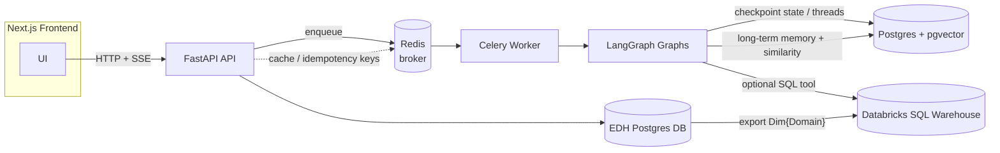
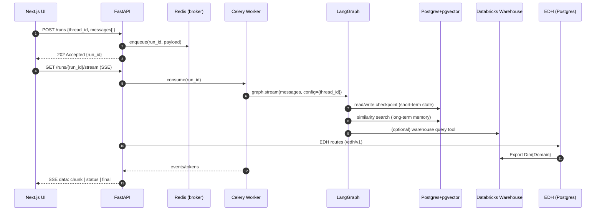

# Architecture — Local‑first LangGraph + FastAPI

**Goal:** ship quickly with a dependable, local‑first stack that every developer can run in Docker. Use one database (Postgres + `pgvector`) for state and vectors. Keep the API responsive by offloading long‑running agent work to a queue. Stream tokens/events to the UI over **Server‑Sent Events (SSE)**.

---

## Containers & responsibilities



**Why this shape works**

- **Separation of concerns:** API returns `202 Accepted` + `run_id`; workers do the heavy lifting; Postgres is the durable source of truth (LangGraph state + long‑term memory + vectors).
- **Low cognitive load:** one DB for everything (state + vectors) via `pgvector`.
- **Fail‑fast:** we do **not** implement graceful fallbacks. Misconfiguration (e.g., missing env var) is a hard error; the process exits loudly.
- **Migration‑ready:** switch Postgres to **Lakebase**; add **Mosaic AI Vector Search** if/when you want a UC‑governed managed index. Wrap agents with **Databricks Agents** without rewriting core logic.

---

## Request & streaming lifecycle



### API surface (opinionated)

- `POST /runs` → `202` with `{ run_id }`
- `GET /runs/{run_id}` → `{ status, result? }`
- `GET /runs/{run_id}/stream` → `text/event-stream` (SSE); emits `{type, data}` frames
- `GET /health` → liveness only (no DB touch)

**Payloads**

```jsonc
// POST /runs
{
  "thread_id": "acme:simond:12345",
  "messages": [
    {"role": "user", "content": "Summarise the latest meeting notes"}
  ]
}

// GET /runs/{id} response
{"status": "PENDING" | "STARTED" | "SUCCESS" | "FAILURE", "result": null | [...]}
```

---

## State & memory model

- **Short‑term** (per run/thread): LangGraph **PostgresSaver** checkpointer — resumability, time‑travel, fault‑tolerance.
- **Long‑term** (user/org memory, retrieval): LangGraph **PostgresStore** with `pgvector` for similarity search; scoped by namespaces like `("memories", org_id, user_id)`.
- **Embeddings:** `text-embedding-3-small` (`1536` dims) by default; keep the embedder behind a single helper so you can swap.

> Thread IDs are formatted as `{org_id}:{user_id}:{session_id}` to avoid collisions.

---

## Key decisions (no alternatives)

1. **Docker Compose only** for local dev; no Kubernetes.
2. **Celery + Redis** for queueing. No Dramatiq. Redis is **broker and result backend** only; not a database.
3. **SSE for streaming**. No WebSockets. The API provides an SSE endpoint per run. If the browser does not support SSE, we do not provide a fallback.
4. **Postgres 16 + pgvector** as the single datastore for LangGraph state and vectors.
5. **Pydantic Settings** for configuration. Missing required envs cause immediate process exit.
6. **Databricks connectivity** via Databricks SQL Connector (Python) from a thin “warehouse tool” function.
7. **No silent retries**. Celery concurrency is bounded; failures are visible and bubble to the client via terminal SSE events and `GET /runs/{id}`.
8. **Minimal observability** now: JSON logs to stdout with `run_id` correlation; metrics later.

---

## Entity Data Hub (EDH)

**What it is**
- An internal service (served by the same FastAPI app and frontend) that acts as an Entity Registry and Hierarchy store for domains such as Geography, Product, Time, etc.
- Provides stable surrogate keys (`{domain}_key` and `{domain}_{hierarchy}_key`), parallel hierarchies, time‑versioned memberships, deterministic matching (business key/name), and lineage.
- Exposes simple ingestion and lookup APIs and produces exported dimensions `Dim{Domain}` with one surrogate key per requested hierarchy (e.g., `geography_rma_key`, `geography_market_key`).

**Why it exists**
- Downstream analytics and agent SQL need clean, stable dimension keys without guessing. EDH centralizes this logic and feeds the warehouse with authoritative dimensions.

**How it fits here**
- Runs in the same API process (routes under `/edh/v1`), backed by a dedicated Postgres database (`EDH`).
- Workers can call EDH to resolve entities or fetch dimension keys; exports feed the Databricks warehouse when needed.

**Endpoints (high‑level)**
- Domains & hierarchies CRUD; ingestion jobs (CSV + mapping);
- Deterministic match check; parent resolution; lineage;
- Export `GET /edh/v1/exports/dim/{domain}?as_of=...&hierarchies=...`.

---

## Path to Databricks

- **Lakebase** (managed Postgres): point `DATABASE_URL` at Lakebase; keep `pgvector`.
- **Mosaic AI Vector Search**: when needed, mirror corpora from Postgres to a UC‑governed index; leave the LangGraph store API intact.
- **Databricks Agents (Mosaic AI Agent Framework)**: wrap your existing LangGraph graphs; expose tools via **Unity Catalog Functions** or MCP; deploy on Model Serving with MLflow as the packaging format.

---

## Repos

1) data - this contains the Databricks ETL and Warehouse Objects
2) gain - this include the Application UI, LangGraph Services (including API) and the supporting database
3) edh - this includes the UI, API and Database to support the EDH product 

---

## Operational notes

- Bound Celery workers to your laptop cores (`--concurrency=2..4`).
- Use a single **document table** plus an **embedding table**; keep hashes and metadata JSON for easy re‑indexing/migrations.
- Run `.setup()` once for both LangGraph **PostgresSaver** and **PostgresStore** to create tables and indexes.
