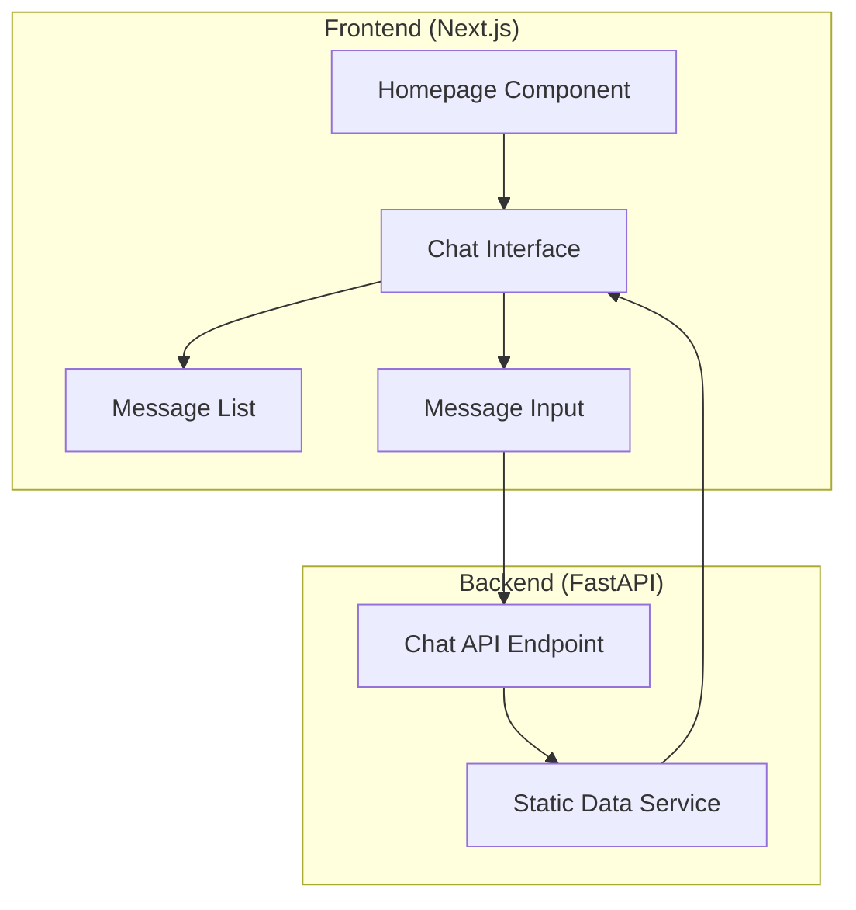
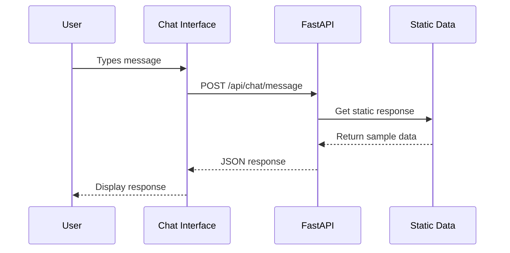

# Implementation Plan - Conversational Interface MVP

## Document Control
**Feature Name & Link:** [Conversational UI Foundation](./feature.md)
**Date:** August 31, 2025  

---

## Executive Summary

This plan delivers a simplified MVP for the Conversational Interface feature - a basic homepage with chat interface connected to a FastAPI endpoint returning static data. The implementation follows the existing gain repo structure and focuses solely on core functionality without authentication, Docker, or mobile optimization.

### Scope
- **In Scope:** 
  - Basic homepage with chat interface
  - FastAPI endpoint returning static revenue data
  - Simple message exchange between frontend and backend
  - Design system colors implementation
  - Desktop-only responsive design
- **Out of Scope:** 
  - Authentication/authorization
  - Docker containerization
  - Mobile/responsive design
  - Real-time streaming (SSE)
  - Database persistence
  - AI agent integration
  - Production deployment
  - PII handling
  - Complex error handling

---

## Architecture Alignment

### System Context
This MVP creates the foundation for conversational interactions within the existing Next.js + FastAPI architecture:

### Architectural Decisions
| Decision | Rationale | Impact |
|----------|-----------|--------|
| Static data responses | Simplifies MVP, enables immediate testing | No database dependency |
| No authentication | Reduces complexity for MVP | Public access only |
| Desktop-only design | Focuses development effort | Limited device support |
| Direct API calls | Simplest integration pattern | No real-time features |

### Design Principles Applied
- [x] Local-first development (using existing infra repo's Postgres/Redis)
- [x] Fail-fast approach (basic error handling)
- [x] Simple and clear design, no over-complication
- [x] Follows existing repo layout exactly

---

## Repository Changes Overview

### 1. Gain Repository (`/gain`)

#### Scope of Work
- **Complexity:** Low
- **Primary Changes:** Basic chat interface and static API endpoint
- **Cross-component Dependencies:** None

#### Frontend (Next.js)
**Component Strategy:**
- New components needed: ChatInterface, MessageBubble, MessageInput
- Existing components requiring modification: None (new homepage)
- Routing changes: Update homepage route
- State management approach: Simple React useState

#### API Layer (FastAPI)
**Endpoint Strategy:**
- New endpoints: POST /api/chat/message (single endpoint)
- Modified endpoints: None
- SSE requirements: None (simple request/response)
- Authentication/authorization changes: None

#### Database Design (Postgres)
**Schema Strategy:**
- New tables: None (static responses)
- Schema modifications: None
- Index requirements: None
- Migration approach: None required

---

## Data Flow Architecture

### High-Level Flow

### Data Transformation Strategy
1. **Input Layer:**
   - User text input via chat interface
   - Simple validation (length, content)

2. **Processing Layer:**
   - Static response mapping based on keywords
   - Basic response formatting

3. **Output Layer:**
   - JSON response with text and optional data
   - Simple message display in chat

---

## Implementation Phases

### Phase 1: Backend Foundation (Days 1-2)
**Objective:** Create basic API structure and static data endpoint
- Basic FastAPI app structure following repo layout
- Single chat endpoint with static responses
- Sample revenue data responses

### Phase 2: Frontend Components (Days 3-4)
**Objective:** Build basic chat interface components
- Homepage with chat interface
- Message input and display components
- Design system color implementation

### Phase 3: Integration (Day 5)
**Objective:** Connect frontend to backend
- API integration
- Basic error handling
- End-to-end testing

---

## Success Criteria

### Technical Success Metrics
- [x] Homepage loads with chat interface
- [x] User can send messages
- [x] API returns static responses
- [x] Design system colors applied
- [x] Basic error handling works

### Business Success Metrics
- [x] Demonstrates conversational interface concept
- [x] Provides foundation for future AI integration
- [x] Enables user testing and feedback collection