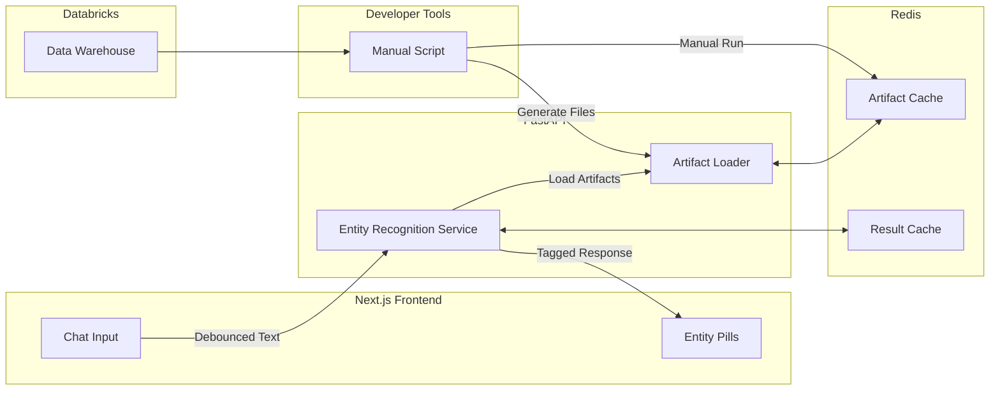
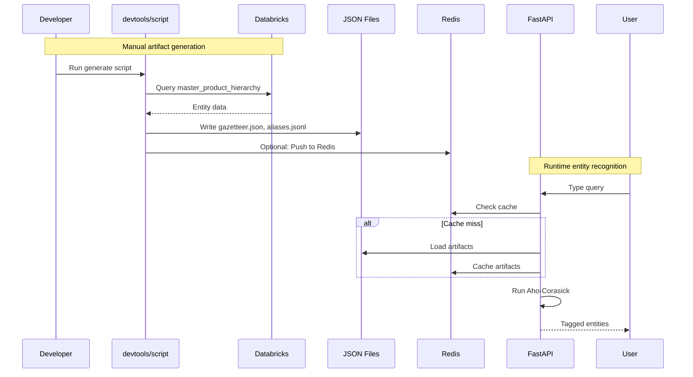

# Implementation Plan - Live Intent Highlighting

## Document Control
**Feature Name & Link:** [Live Intent Highlighting for Conversational Interface](./feature.md)
**Date:** September 1, 2025  

---

## Executive Summary

This plan outlines the technical implementation of real-time entity highlighting for the Gain platform's conversational interface. The solution leverages pre-built artifacts generated from the data warehouse to provide sub-100ms entity recognition as users type natural language queries. The implementation follows a local-first approach using the existing LangGraph + FastAPI architecture, with Redis caching for performance and local JSON artifacts for entity data.

The core approach uses a manual Python script to extract entity data from Databricks, generating local JSON artifacts that are then used by a deterministic matching service via Aho-Corasick automaton for exact matches, supplemented by fuzzy matching for variations. Entity artifacts are generated manually by developers and cached in Redis for fast access. The frontend renders highlighted entities as interactive pills using React components with debounced API calls.

### Scope
- **In Scope:** 
  - Manual entity artifact generation script using Databricks SDK
  - FastAPI endpoint for real-time entity recognition
  - React components for inline entity highlighting and pills
  - Redis caching layer for artifacts and results
  - Fuzzy matching for common variations
  - Support for manufacturers, products, metrics, and time periods
  
- **Out of Scope:** 
  - Authentication/authorization (using existing system)
  - Mobile-specific responsive design
  - Complex NLP or ML models
  - Production deployment configuration
  - Advanced auto-completion features
  - Entity disambiguation UI
  - Automated ETL pipelines

---

## Architecture Alignment

### System Context

The feature integrates into the existing Gain architecture as a new capability within the conversational interface:

### Architectural Decisions

| Decision | Rationale | Impact |
|----------|-----------|--------|
| Manual script instead of ETL pipeline | Simpler MVP approach, developer control over refresh timing | Requires manual execution, no automatic updates |
| Local JSON artifacts in Gain repo | Fast loading, version controlled, no external dependencies | Larger repo size, manual updates needed |
| Databricks SDK for data extraction | Direct access to warehouse tables, no intermediate systems | Requires SDK authentication setup |
| Aho-Corasick automaton for exact matching | O(n) complexity for multiple pattern matching, ideal for large entity sets | Requires pre-built trie structure, memory overhead ~50MB |
| Redis for artifact caching | Sub-millisecond access, reduces file I/O load | Additional Redis memory usage, cache invalidation complexity |
| Debounced API calls (500ms) | Reduces API load while maintaining responsive feel | Slight delay in highlighting, better for typing flow |
| Separate artifacts for gazetteer and aliases | Optimizes exact vs fuzzy matching paths | Two-stage matching process, more complex artifact generation |
| XML-style tags for response format | Simple to parse, preserves original text structure | Frontend parsing required, escaping considerations |

### Design Principles Applied
- ✅ Local-first development (Docker Compose, local artifacts)
- ✅ Fail-fast approach (no silent failures)
- ✅ MVP simplicity (manual script vs automated pipeline)
- ✅ Any new technologies/libraries/frameworks clearly explained in Architectural Decisions
- ✅ High Level Design is Clear and Simple, not over complicated or adding features not requested by the Feature document

---

## Repository Changes Overview

### 1. Gain Repository (`/gain`)
*Primary repository for all implementation*

#### Scope of Work
- **Complexity:** High
- **Primary Changes:** New devtools script for artifact generation, entity recognition service, React highlighting components, Redis caching integration
- **Cross-component Dependencies:** Redis for caching, Databricks SDK for data extraction

#### Developer Tools
**Script Strategy:**
- New directory: `/gain/devtools/`
- Main script: `generate_entity_artifacts.py` - Connects to Databricks and generates artifacts
- Configuration: `.env.example` for Databricks credentials
- Documentation: `README.md` with usage instructions
- Output location: `/gain/apps/api/app/data/artifacts/`

#### Frontend (Next.js)
**Component Strategy:**
- New components needed: 
  - `EntityPill` - Renders individual entity as styled pill
  - `HighlightedText` - Parses and renders text with entity pills
  - `EntityRecognitionProvider` - Context for entity recognition state
- Existing components requiring modification: 
  - `ChatInput` - Add debounced entity recognition calls
  - `MessageDisplay` - Support rendering highlighted entities
- Routing changes: None
- State management approach: React Context for entity recognition state, local component state for UI interactions

#### API Layer (FastAPI)
**Endpoint Strategy:**
- New endpoints: 
  - `POST /api/chat/recognize-entities` - Main entity recognition endpoint
  - `POST /api/admin/refresh-artifacts` - Trigger artifact reload from files
- Modified endpoints: None
- SSE requirements: None (using standard HTTP responses)
- Authentication/authorization changes: None (using existing session management)

**Service Layer:**
- New services:
  - `entity_recognizer.py` - Core recognition logic
  - `aho_corasick_matcher.py` - Efficient pattern matching
  - `artifact_loader.py` - Loads and caches JSON artifacts
  - `cache_manager.py` - Redis cache management

#### Database Design (Postgres)
**Schema Strategy:**
- New tables: 
  - `entity_artifacts` - Stores artifact versions and metadata
  - `entity_cache_stats` - Tracks cache performance metrics
- Schema modifications: None
- Index requirements: Index on artifact version for quick lookup
- Migration approach: Standard Alembic migration

---

### 2. Data Repository (`/data`)
*Reference only - no changes required*

#### Scope of Work
- **Complexity:** None
- **Primary Changes:** None - only used as reference for table structure
- **Dependencies:** Read-only access to `rgm_poc.chocolate.master_product_hierarchy` table

---

### 3. EDH Repository (`/edh`)
*No changes required*

#### Scope of Work
- **Complexity:** None
- **Primary Changes:** None - EDH provides source data but no changes required
- **Impact on Downstream:** Entity artifacts will reference EDH keys for consistency

---

### 4. Infra Repository (`/infra`)
*Minor configuration changes*

#### Scope of Work
- **Complexity:** Low
- **Primary Changes:** Redis memory allocation increase
- **Impact on Downstream:** None

#### Infrastructure Components
**Docker Changes:**
- New Images: None
- Configuration modifications: 
  - Increase Redis max memory to 2GB for artifact caching
  - Add Redis persistence for artifact cache
- Features: Redis maxmemory-policy set to allkeys-lru

---

## Data Flow Architecture

### High-Level Flow

### Data Transformation Strategy
1. **Extraction Layer (Manual Script):**
   - Source: `rgm_poc.chocolate.master_product_hierarchy` table
   - Connection: Databricks SDK with authentication
   - Query: Extract all hierarchy levels with relationships
   - Validation: Entity uniqueness, valid IDs, hierarchy integrity

2. **Processing Layer (Script):**
   - Transformation: 
     - Group entities by type (manufacturer, brand, category, product)
     - Generate aliases (plurals, abbreviations, variations)
     - Build hierarchy paths for context
   - Output format:
     - `gazetteer.json`: Structured entity lists by type
     - `aliases.jsonl`: Line-delimited alias mappings
   - Size optimization: Compress repeated data, limit to essential fields

3. **Runtime Layer (API):**
   - Loading: Lazy load artifacts on first request
   - Caching: 24-hour TTL in Redis for artifacts
   - Matching: Aho-Corasick trie for O(n) complexity
   - Response: XML-tagged text with entity metadata

---

## Testing Strategy

### Test Coverage Approach
- **Unit Testing:** 
  - Entity matcher accuracy (>95% coverage)
  - Artifact generation validation
  - React component rendering
  - Cache operations
- **Integration Testing:** 
  - End-to-end highlighting flow
  - Cache invalidation scenarios
  - API latency under load
  - Script to API pipeline
- **Manual Testing:**
  - Developer script execution
  - Artifact refresh process
  - UI interaction with pills

---

## Implementation Phases

### Phase 1: Foundation
**Objective:** Create manual artifact generation infrastructure
- Develop `devtools/generate_entity_artifacts.py` script
- Set up Databricks SDK authentication
- Generate initial JSON artifacts
- Document script usage

### Phase 2: Caching Layer
**Objective:** Implement Redis caching infrastructure
- Configure Redis for 2GB memory
- Implement cache manager service
- Create artifact loader with caching
- Add cache statistics tracking

### Phase 3: Core Recognition
**Objective:** Implement entity recognition service
- Build Aho-Corasick matcher
- Create FastAPI endpoint
- Implement result caching
- Add performance monitoring

### Phase 4: UI Components
**Objective:** Complete frontend highlighting experience
- Develop React pill components
- Implement debounced input handler
- Add highlighting renderer
- Integrate with chat interface

### Phase 5: Enhancement
**Objective:** Add fuzzy matching and optimize
- Integrate RapidFuzz for variations
- Performance optimization
- Add comprehensive logging
- Complete documentation

---

## Success Criteria

### Technical Success Metrics
- ✅ Manual script successfully extracts entities from Databricks
- ✅ Artifacts generated in < 2 minutes
- ✅ Performance targets met (<100ms P95 latency)
- ✅ Cache hit rate > 80%
- ✅ All architectural principles adhered to

### Business Success Metrics
- ✅ Feature requirements fulfilled (real-time highlighting)
- ✅ User acceptance achieved (intuitive pill interactions)
- ✅ Quality standards met (>95% entity recognition accuracy)
- ✅ MVP simplicity maintained (manual process acceptable)